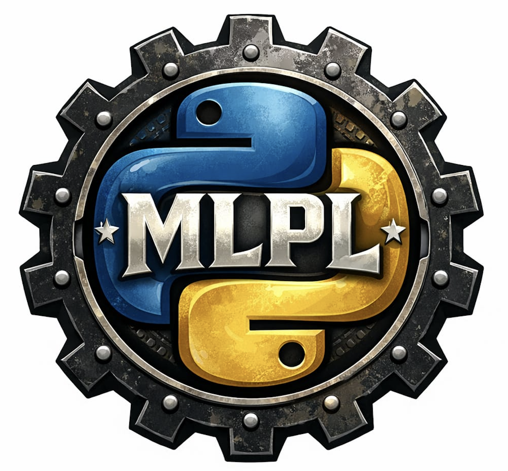

#  MLPL

MLPL is a Rust-first array and tensor programming language for
machine learning, visualization, and experimentation. Inspired by
APL, APL2, J, and BQN.

**[Try MLPL in your browser](https://sw-ml-study.github.io/sw-mlpl/)**
-- no install required.

## Documentation

User-facing guides:

- [`docs/usage.md`](docs/usage.md) -- user guide with worked
  examples (arrays, labels, autograd, Model DSL, tokenizers,
  experiments, training a tiny LM)
- [`docs/lang-reference.md`](docs/lang-reference.md) -- language
  grammar + every built-in, grouped by category
- [`docs/repl-guide.md`](docs/repl-guide.md) -- REPL commands
  (`:vars`, `:describe`, `:wsid`, `:experiments`, ...) and the
  terminal-vs-web surface
- [`docs/compiler-guide.md`](docs/compiler-guide.md) -- how to
  get MLPL out of the REPL: `mlpl!` proc macro + `mlpl build`
  native binaries
- [`docs/compiling-mlpl.md`](docs/compiling-mlpl.md) -- the
  design rationale behind the compile path
- [`docs/compiler-implementation.md`](docs/compiler-implementation.md)
  -- educational tour of how the MLPL compiler is built (lexing,
  parsing, AST, interpreter, lowerer, runtime target)
- [`docs/benchmarks.md`](docs/benchmarks.md) -- interpreter vs
  compiled speed, reproducible via `cargo bench -p mlpl-bench`

Backend / integration roadmap (forward-looking, not yet
shipped):

- [`docs/using-mlx.md`](docs/using-mlx.md) -- Apple Silicon
  MLX backend (Saga 14)
- [`docs/using-cuda.md`](docs/using-cuda.md) -- CUDA backend +
  distributed execution (Saga 17)
- [`docs/using-ollama.md`](docs/using-ollama.md) -- calling
  Ollama / llama.cpp / OpenAI-compatible LLM servers (Saga 19)

Project-level:

- [`docs/architecture.md`](docs/architecture.md) -- cellular
  monorepo layout and crate dependency flow
- [`docs/saga.md`](docs/saga.md) -- implementation saga overview
  (what shipped, what's next)
- [`docs/status.md`](docs/status.md) -- one-line-per-saga
  scoreboard
- [`docs/plan.md`](docs/plan.md) -- forward-looking saga plan
- [`docs/prd.md`](docs/prd.md) -- product requirements

## Quick Start

```bash
# Build
cargo build

# Interactive REPL
cargo run -p mlpl-repl

# Run a demo script
cargo run -p mlpl-repl -- -f demos/basics.mlpl

# Train a tiny language model (Saga 13)
cargo run -p mlpl-repl -- -f demos/tiny_lm.mlpl

# Compile a .mlpl file to a native binary
cargo run -p mlpl-build -- examples/compile-cli/hello.mlpl -o /tmp/hello
/tmp/hello                                # -> 21

# Interpreter vs compiled benchmark
cargo bench -p mlpl-bench
```

## What MLPL Can Do

```text
mlpl> 1 + 2
3
mlpl> [1, 2, 3] * 10
10 20 30
mlpl> X : [batch, feat] = reshape(iota(6), [2, 3])
0 1 2
3 4 5
mlpl> labels(X)
batch,feat
mlpl> reduce_add(X, "feat")
3 12
mlpl> mdl = chain(linear(2, 4, 11), relu_layer(), linear(4, 2, 12))
mlpl> :describe mdl
mdl -- model
  shape: chain(linear -> relu -> linear)
  params:
    __linear_W_0: [2, 4]
    __linear_b_0: [4]
    __linear_W_1: [4, 2]
    __linear_b_1: [2]
mlpl> corpus = load_preloaded("tiny_corpus")
mlpl> tok = train_bpe(corpus, 260, 0)
mlpl> apply_tokenizer(tok, "the quick brown fox")
116 104 101 32 113 117 105 99 107 32 98 114 111 119 110 32 102 111 120
```

## Features

- **Array language.** APL-flavored syntax, 0-origin indexing,
  element-wise arithmetic with scalar broadcasting, matmul +
  dot, reshape + transpose + axis reductions.
- **Labeled shapes** (Saga 11.5). Annotation syntax
  `X : [batch, feat] = ...` carries axis names through every
  op; mismatches surface as a structured
  `EvalError::ShapeMismatch` that names both shapes.
- **Autograd** (Saga 9). `param[shape]` + `grad(expr, wrt)`, a
  reverse-mode tape over the full array op set.
- **Optimizers + training loop** (Saga 10). `adam`,
  `momentum_sgd`, schedules, and a `train N { body }` construct
  that binds `step` and captures `last_losses`.
- **Model DSL** (Saga 11). Composable layers: `linear`,
  `chain`, `residual`, `rms_norm`, `attention`,
  `causal_attention`, `embed`, `sinusoidal_encoding`,
  activations, `apply`, `params`.
- **Tokenizers + datasets** (Saga 12). `load` / `load_preloaded`
  with a `--data-dir` sandbox, `shuffle` / `batch` / `split`,
  `for row in X { ... }`, byte-level + BPE tokenizers
  (`tokenize_bytes`, `train_bpe`, `apply_tokenizer`, `decode`),
  and reproducible `experiment "name" { ... }` blocks with
  `:experiments` / `compare`.
- **Tiny LM end-to-end** (Saga 13). `embed`,
  `sinusoidal_encoding`, `causal_attention`, `cross_entropy`,
  `sample` + `top_k`, `last_row`, `concat`,
  `attention_weights` -- enough to train and generate from a
  tiny transformer LM on CPU.
- **Compile to Rust / native** (v0.8.0). `mlpl!` proc macro
  for embedding in a Rust program; `mlpl build foo.mlpl -o bin`
  for native binaries; cross-compile via `--target <triple>`.
  No parser or interpreter in the compiled output.
- **Two REPLs** with shared evaluator: terminal
  (`cargo run -p mlpl-repl`, tracing, `--data-dir`, `--exp-dir`)
  and browser (`apps/mlpl-web`, tutorial lessons, demo
  selector, inline SVG rendering).
- **APL-inspired introspection.** `:wsid` / `:vars` /
  `:models` / `:describe` / `:builtins` / `:experiments` /
  `:version` / `:help <topic>`. See
  [`docs/repl-guide.md`](docs/repl-guide.md).
- **Execution tracing.** `:trace on`, `:trace json <path>` for
  per-op JSON export (terminal REPL).
- **Inline visualization.** `svg(data, type)` for
  scatter/line/bar/heatmap/decision_boundary, plus
  `hist` / `scatter_labeled` / `loss_curve` /
  `confusion_matrix` / `boundary_2d` high-level helpers.

## Architecture

Cellular monorepo with narrow crates:

`core -> array/parser -> runtime -> eval -> trace -> viz/wasm/apps -> ml`

See [`docs/architecture.md`](docs/architecture.md) for crate
responsibilities and the dependency flow, and
[`docs/repo-structure.md`](docs/repo-structure.md) for the
directory map.

## Development

```bash
cargo test                                          # run all tests
cargo clippy --all-targets --all-features -- -D warnings
cargo fmt --all
cargo bench -p mlpl-bench                           # interp vs compiled
markdown-checker -f "**/*.md"                       # ASCII-only markdown
sw-checklist                                        # project standards
```

`MLPL_PARITY_TESTS=1 cargo test -p mlpl-parity-tests` runs the
interpreter-vs-compiled parity gate (gated because it shells out
to rustc).

## Demo Scripts

Ready-to-run examples in `demos/`:

```bash
# Basics / arrays / reductions
cargo run -p mlpl-repl -- -f demos/basics.mlpl
cargo run -p mlpl-repl -- -f demos/matrix_ops.mlpl
cargo run -p mlpl-repl -- -f demos/computation.mlpl
cargo run -p mlpl-repl -- -f demos/repeat_demo.mlpl

# ML foundations
cargo run -p mlpl-repl -- -f demos/logistic_regression.mlpl
cargo run -p mlpl-repl -- -f demos/kmeans.mlpl
cargo run -p mlpl-repl -- -f demos/pca.mlpl
cargo run -p mlpl-repl -- -f demos/softmax_classifier.mlpl
cargo run -p mlpl-repl -- -f demos/tiny_mlp.mlpl

# Model DSL + training
cargo run -p mlpl-repl -- -f demos/moons_mlp.mlpl
cargo run -p mlpl-repl -- -f demos/circles_mlp.mlpl
cargo run -p mlpl-repl -- -f demos/attention.mlpl
cargo run -p mlpl-repl -- -f demos/transformer_block.mlpl

# Tiny LM (Saga 13)
cargo run -p mlpl-repl -- -f demos/tiny_lm.mlpl
cargo run -p mlpl-repl -- -f demos/tiny_lm_generate.mlpl

# Visualization + tracing
cargo run -p mlpl-repl -- -f demos/loss_curve.mlpl
cargo run -p mlpl-repl -- -f demos/decision_boundary.mlpl
cargo run -p mlpl-repl -- -f demos/analysis_demo.mlpl
cargo run -p mlpl-repl -- -f demos/trace_demo.mlpl --trace
```

The same demos are wired into the web REPL's demo dropdown,
where a "Workspace Introspection" demo additionally exercises
every `:`-prefixed command.

## Links

- Blog: [Software Wrighter Lab](https://software-wrighter-lab.github.io/)
- Discord: [Join the community](https://discord.com/invite/Ctzk5uHggZ)
- YouTube: [Software Wrighter](https://www.youtube.com/@SoftwareWrighter)

## Copyright

Copyright (c) 2026 Michael A Wright

## License

MIT. See [`LICENSE`](LICENSE) and [`COPYRIGHT`](COPYRIGHT).
