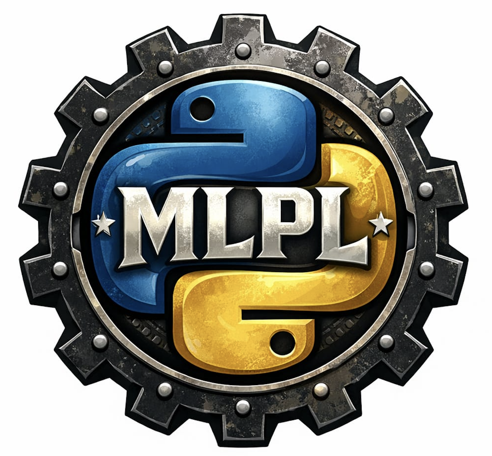

#  sw-MLPL

[](https://github.com/sw-ml-study/sw-mlpl/actions/workflows/pages/pages-build-deployment)
[](https://sw-ml-study.github.io/sw-mlpl/)
[](https://sw-ml-study.github.io/sw-mlpl/build-info.json)

Quality gates (tests, clippy, fmt, project standards) run
LOCALLY before every commit; the badges above read the live
site's own build stamp -- no builders run on GitHub.

Software Wrighter's Machine Learning Programming Language --
a Rust-first array and tensor language for machine learning,
visualization, and experimentation. Inspired by APL, APL2, J,
and BQN.

sw-MLPL is a Rust-implemented, array-oriented, functional-first
machine-learning language with higher-order functions, explicit
imperative constructs, native autograd/model facilities, WASM
execution, and Rust-native accelerator backends using MLX/mlx-rs
on Apple Silicon and Candle/cudarc/CUDA on NVIDIA.

At a glance, versus a mainstream Python ML stack:

| Category              | Mainstream Python ML           | sw-MLPL                                       |
| --------------------- | ------------------------------ | --------------------------------------------- |
| User language         | Python                         | sw-MLPL                                       |
| Language style        | multiparadigm / OO-heavy       | array-oriented, functional-first; + imperative bindings/control |
| Object model          | classes / objects / methods    | no conventional OO model                      |
| Functions             | first-class functions/closures | UDFs + first-class function references        |
| Higher-order funcs    | yes                            | yes                                           |
| Partial application   | supported idiomatically        | explicit Partial runtime value                |
| Arrays                | NumPy / framework tensors      | native language value                         |
| Broadcasting          | NumPy / framework              | built into array semantics                    |
| Implementation        | CPython C + native frameworks  | Rust                                          |
| Memory management     | refcount + cyclic GC           | Rust ownership/RAII; Box/Arc where needed; no tracing GC |
| CPU arrays            | NumPy / PyTorch / etc.         | Rust DenseArray reference implementation      |
| **Apple Silicon**     |                                |                                               |
| Apple framework       | PyTorch MPS / MLX / etc.       | MLX                                           |
| Apple Rust stack      | N/A for a normal Python user   | mlx-rs                                        |
| Apple acceleration    | Metal / Accelerate             | MLX + Metal + Accelerate                      |
| Apple residency       | framework-managed              | TensorHandle device-resident tape             |
| **NVIDIA**            |                                |                                               |
| NVIDIA framework      | PyTorch / JAX / TensorFlow     | sw-MLPL CUDA backend                          |
| NVIDIA Rust stack     | hidden behind Python framework | Candle                                        |
| CUDA interface        | native framework CUDA code     | Candle -> cudarc -> CUDA                       |
| CUDA maturity         | mature                         | experimental vertical slice                   |
| **Ecosystem**         |                                |                                               |
| Autograd              | PyTorch / JAX / TensorFlow     | built-in reverse-mode tape                    |
| Model abstraction     | torch.nn / Keras / etc.        | built-in Model DSL                            |
| Literate programming  | Jupyter / Colab                | Emacs org-mode + Babel                        |
| Browser execution     | Jupyter / Colab / Pyodide      | Rust -> WASM playground                        |
| Native compilation    | packaging / native extensions  | compile-to-Rust subset                        |

This repository ships three things together:

- the **language** itself (interpreter, parser, autograd,
  Model DSL, MLX backend, compile-to-Rust path),
- a curated set of **demos** that walk through every
  language feature end-to-end, and
- a browser **playground** that runs both via WASM with no
  install.

**[Try the playground in your browser](https://sw-ml-study.github.io/sw-mlpl/?ts=1777922058129)**
-- no install required.

## Tour

The web playground gives you a full REPL plus 94 worked
demos, 58 tutorial lessons, and a 476-entry glossary --
all running entirely in your browser via WASM. (These
counts are pinned by tests against the demo, lesson, and
glossary registries, so they cannot silently drift.)

### REPL


The default view. Type MLPL expressions at the
`mlpl>` prompt; type `:help` for the full slash-command
list, click `?` for the documentation modal, or pick a
demo from the **Load Demo...** dropdown to walk through
worked examples.

### Visualizations demo


Every demo opens with an "About this demo" panel and
closes with a "What just happened" takeaway. Long-running
demos add intermediate progress callouts so the page
never appears to hang. The **Visualizations** demo is
the four primitive `svg()` types -- scatter, line, bar,
heatmap -- in one line each.

### Tutorial


The Tutorial tab opens to an Index of all 58 lessons
(default), with the current lesson highlighted in
peach. Click any tile to jump directly; the Lesson tab
holds prev / next pagination if you prefer step-by-step.
The Tutorial uses an isolated session + transcript --
your main REPL state is preserved when you switch tabs.

### Documentation: Language Reference


The first tab of the `?` documentation modal.
Grammar, syntax, and the full builtin surface grouped
by category (Array, Linear algebra, Math, Comparisons,
ML primitives, Autograd, Model DSL, Visualization).

### Documentation: Usage Guide


The second tab. Worked examples for every major
language feature: arrays, named axes, autograd, the
Model DSL, tokenizers, experiment tracking, training
a tiny LM end-to-end.

### Documentation: Glossary


The third tab. Alphabetical entries covering every
language keyword, builtin, and ML concept the demos
touch. Type-to-filter search at the top: typing
`attention` shows every matching entry, best match
first. Each entry names the closest
MLPL construct or plainly says the concept is not in
MLPL / out of scope.

## Documentation

User-facing guides:

- [`docs/usage.md`](docs/usage.md) -- user guide with worked
  examples (arrays, labels, autograd, Model DSL, tokenizers,
  experiments, training a tiny LM)
- [`docs/lang-reference.md`](docs/lang-reference.md) -- language
  grammar + every built-in, grouped by category
- [`docs/repl-guide.md`](docs/repl-guide.md) -- REPL commands
  (`:vars`, `:describe`, `:wsid`, `:experiments`, ...) and the
  terminal-vs-web surface
- [`docs/compiler-guide.md`](docs/compiler-guide.md) -- how to
  get MLPL out of the REPL: `mlpl!` proc macro + `mlpl build`
  native binaries
- [`docs/compiling-mlpl.md`](docs/compiling-mlpl.md) -- the
  design rationale behind the compile path
- [`docs/compiler-implementation.md`](docs/compiler-implementation.md)
  -- educational tour of how the MLPL compiler is built (lexing,
  parsing, AST, interpreter, lowerer, runtime target)
- [`docs/benchmarks.md`](docs/benchmarks.md) -- interpreter vs
  compiled speed and the MLX-vs-CPU tables, reproducible via
  `cargo bench -p mlpl-bench` in `components/dev-tools`

Backend / integration guides (MLX, an in-process CUDA
vertical slice, and LLM-server calls have all shipped;
each guide notes what is implemented vs still planned):

- [`docs/using-mlx.md`](docs/using-mlx.md) -- Apple Silicon MLX
  backend: shipped, with GPU-resident training via the
  persistent-tensor tape (see `docs/benchmarks.md` for numbers)
- [`docs/using-cuda.md`](docs/using-cuda.md) -- historical design
  doc; the shipped scope lives in `docs/saga-cuda-foundation.md`
  and `docs/saga-cuda-demo-parity.md` (the separate CUDA peer
  service and distributed execution remain future work)
- [`docs/using-ollama.md`](docs/using-ollama.md) -- calling
  Ollama / llama.cpp / OpenAI-compatible LLM servers (`llm_call`
  and `:ask` are shipped in the native paths)

Project-level:

- [`docs/architecture.md`](docs/architecture.md) -- cellular
  monorepo layout and crate dependency flow
- [`docs/saga.md`](docs/saga.md) -- implementation saga overview
  (what shipped, what's next)
- [`docs/status.md`](docs/status.md) -- one-line-per-saga
  scoreboard
- [`docs/plan.md`](docs/plan.md) -- forward-looking saga plan
- [`docs/prd.md`](docs/prd.md) -- product requirements

## Quick Start

The repository is a cellular monorepo: each `components/<name>/`
is its own cargo workspace and there is no root `Cargo.toml`, so
build commands run inside the owning component (or use
`--manifest-path`). Binaries land in the shared repo-root
`target/`.

```bash
# Interactive REPL (component: cli)
cargo run --manifest-path components/cli/Cargo.toml -p mlpl-repl

# Run a demo script
cargo run --manifest-path components/cli/Cargo.toml -p mlpl-repl -- -f demos/basics.mlpl

# Train a tiny language model
cargo run --manifest-path components/cli/Cargo.toml -p mlpl-repl -- -f demos/tiny_lm.mlpl

# Compile a .mlpl file to a native binary
cargo run --manifest-path components/cli/Cargo.toml -p mlpl-build -- examples/compile-cli/hello.mlpl -o /tmp/hello
/tmp/hello                                # -> 21

# Interpreter vs compiled benchmark (component: dev-tools)
cargo bench --manifest-path components/dev-tools/Cargo.toml -p mlpl-bench
```

## What MLPL Can Do

```text
mlpl> 1 + 2
3
mlpl> [1, 2, 3] * 10
10 20 30
mlpl> X : [batch, feat] = reshape(iota(6), [2, 3])
0 1 2
3 4 5
mlpl> labels(X)
batch,feat
mlpl> reduce_add(X, "feat")
3 12
mlpl> mdl = chain(linear(2, 4, 11), relu_layer(), linear(4, 2, 12))
mlpl> :describe mdl
mdl -- model
  shape: chain(linear -> relu -> linear)
  params:
    __linear_W_0: [2, 4]
    __linear_b_0: [4]
    __linear_W_1: [4, 2]
    __linear_b_1: [2]
mlpl> corpus = load_preloaded("tiny_corpus")
mlpl> tok = train_bpe(corpus, 260, 0)
mlpl> apply_tokenizer(tok, "the quick brown fox")
116 104 101 32 113 117 105 99 107 32 98 114 111 119 110 32 102 111 120
```

## Features

- **Array language.** APL-flavored syntax, 0-origin indexing,
  element-wise arithmetic with scalar broadcasting, matmul +
  dot, reshape + transpose + axis reductions.
- **Labeled shapes.** Annotation syntax
  `X : [batch, feat] = ...` carries axis names through every
  op; mismatches surface as a structured
  `EvalError::ShapeMismatch` that names both shapes.
- **Autograd.** `param[shape]` + `grad(expr, wrt)`, a
  reverse-mode tape over the full array op set.
- **Optimizers + training loop.** `adam`,
  `momentum_sgd`, schedules, and a `train N { body }` construct
  that binds `step` and captures `last_losses`.
- **Model DSL.** Composable layers: `linear`,
  `chain`, `residual`, `rms_norm`, `attention`,
  `causal_attention`, `embed`, `sinusoidal_encoding`,
  activations, `apply`, `params`.
- **Tokenizers + datasets.** `load` / `load_preloaded`
  with a `--data-dir` sandbox, `shuffle` / `batch` / `split`,
  `for row in X { ... }`, byte-level + BPE tokenizers
  (`tokenize_bytes`, `train_bpe`, `apply_tokenizer`, `decode`),
  and reproducible `experiment "name" { ... }` blocks with
  `:experiments` / `compare`.
- **Tiny LM end-to-end.** `embed`,
  `sinusoidal_encoding`, `causal_attention`, `cross_entropy`,
  `sample` + `top_k`, `last_row`, `concat`,
  `attention_weights` -- enough to train and generate from a
  tiny transformer LM on CPU.
- **Compile to Rust / native** (a numerical-expression subset).
  `mlpl!` proc macro for embedding in a Rust program;
  `mlpl build foo.mlpl -o bin` for native binaries;
  cross-compile via `--target <triple>`; no parser or interpreter
  in the compiled output. The lowering covers array/number
  expressions and a handful of builtins (`range`, `shape`, `rank`,
  `reshape`, `transpose`, `reduce_add`, `matmul`, labeling), plus
  strings and stdout/args I/O (`write_stdout`, `args`, `arg`) -- so
  a compiled binary can print and read CLI arguments; the Model
  DSL, `train`, autograd, control flow, functions, and file I/O
  are still interpreter-only. See the maturity note below.
- **Two REPLs** with shared evaluator: terminal
  (`cargo run -p mlpl-repl`, tracing, `--data-dir`, `--exp-dir`)
  and browser (`apps/mlpl-web`, tutorial lessons, demo
  selector, inline SVG rendering).
- **APL-inspired introspection.** `:wsid` / `:vars` /
  `:models` / `:describe` / `:builtins` / `:experiments` /
  `:version` / `:help <topic>`. See
  [`docs/repl-guide.md`](docs/repl-guide.md).
- **Execution tracing.** `:trace on`, `:trace json <path>` for
  per-op JSON export (terminal REPL).
- **Inline visualization.** `svg(data, type)` for
  scatter/line/bar/heatmap/decision_boundary, plus
  `hist` / `scatter_labeled` / `loss_curve` /
  `confusion_matrix` / `boundary_2d` high-level helpers.

## Maturity: what's production-usable vs a proof of concept

This is a research project, and its surfaces are at different
maturity levels. To set expectations honestly:

**Production-usable (built, tested, documented).** The language
core and its tooling: the interpreter/evaluator, parser, dense
arrays with named axes, reverse-mode autograd, the Model DSL,
optimizers and the `train` loop, tokenizers / BPE / datasets /
experiment tracking, the tiny-LM training-and-generation path,
typed ML values and typed traces, the serialization + sandboxed
filesystem surface (JSON and TOML codecs, raw and bounded byte
I/O, atomic writes, `record_keys`, decode limits, the reserved
`$mlpl` tagged envelope), inline SVG visualization, both REPLs
(terminal and browser), and the WASM web playground. These run
the same evaluator and are exercised by the test suite.

**Works, with limits (partial).**

- **MLX (Apple Silicon GPU) backend** -- production-usable for
  non-toy models, with training staying GPU-resident; below the
  CPU/GPU crossover (roughly `d < 128`) it is overhead-bound and
  a CPU run is faster. Numbers: `docs/benchmarks.md`.
- **Connect / server mode** (`mlpl-serve`, `--connect`) -- a
  working multi-client REST surface with SSE streaming eval,
  cancellation, viz storage, and on-disk session persistence.
  Not present: a server-side LLM proxy and a WebSocket transport.
- **LLM integration** (`llm_call`, `:ask`) -- works from the
  native/CLI paths; there is no streaming, tool-calling, or
  browser path.

**Proof of concept (experimental -- do not rely on).**

- **CUDA (NVIDIA GPU) backend** -- a single-GPU, in-process
  vertical slice proven end-to-end on one demo (a LoRA fast
  path). It is not a general backend: a standalone CUDA peer
  service, multi-GPU, and broad operator coverage are out of
  scope today.
- **Compile-to-Rust path** (`mlpl!` / `mlpl build`) -- handles the
  numerical-expression subset plus strings and stdout/args I/O
  (see the Features bullet); a compiled binary can print and read
  CLI arguments. Still interpreter-only (a phased expansion is
  underway): file I/O (`read_bytes` etc.), control flow, user
  functions, the Model DSL, `train`, and autograd.

## Architecture

Cellular monorepo with narrow crates:

`core -> array/parser -> runtime -> eval -> trace -> viz/wasm/apps -> ml`

See [`docs/architecture.md`](docs/architecture.md) for crate
responsibilities and the dependency flow, and
[`docs/repo-structure.md`](docs/repo-structure.md) for the
directory map.

## Development

Run cargo commands inside the component workspace you changed
(e.g. `cd components/eval`); `markdown-checker` and
`sw-checklist` run at the repository root.

```bash
cargo test                                          # tests, per component workspace
cargo clippy --all-targets --all-features -- -D warnings
cargo fmt --all
cargo bench -p mlpl-bench                           # interp vs compiled (components/dev-tools)
markdown-checker -f "**/*.md"                       # ASCII-only markdown
sw-checklist                                        # project standards
```

`MLPL_PARITY_TESTS=1 cargo test -p mlpl-parity-tests` runs the
interpreter-vs-compiled parity gate (gated because it shells out
to rustc).

## Demo Scripts

Ready-to-run examples in `demos/`:

```bash
# Basics / arrays / reductions
cargo run -p mlpl-repl -- -f demos/basics.mlpl
cargo run -p mlpl-repl -- -f demos/matrix_ops.mlpl
cargo run -p mlpl-repl -- -f demos/computation.mlpl
cargo run -p mlpl-repl -- -f demos/repeat_demo.mlpl

# ML foundations
cargo run -p mlpl-repl -- -f demos/logistic_regression.mlpl
cargo run -p mlpl-repl -- -f demos/kmeans.mlpl
cargo run -p mlpl-repl -- -f demos/pca.mlpl
cargo run -p mlpl-repl -- -f demos/softmax_classifier.mlpl
cargo run -p mlpl-repl -- -f demos/tiny_mlp.mlpl

# Model DSL + training
cargo run -p mlpl-repl -- -f demos/moons_mlp.mlpl
cargo run -p mlpl-repl -- -f demos/circles_mlp.mlpl
cargo run -p mlpl-repl -- -f demos/attention.mlpl
cargo run -p mlpl-repl -- -f demos/transformer_block.mlpl

# Tiny LM
cargo run -p mlpl-repl -- -f demos/tiny_lm.mlpl
cargo run -p mlpl-repl -- -f demos/tiny_lm_generate.mlpl

# Visualization + tracing
cargo run -p mlpl-repl -- -f demos/loss_curve.mlpl
cargo run -p mlpl-repl -- -f demos/decision_boundary.mlpl
cargo run -p mlpl-repl -- -f demos/analysis_demo.mlpl
cargo run -p mlpl-repl -- -f demos/trace_demo.mlpl --trace
```

The same demos are wired into the web REPL's demo dropdown,
where a "Workspace Introspection" demo additionally exercises
every `:`-prefixed command.

## Tooling

- Emacs: `editors/emacs/mlpl-mode.el` -- font-lock for the
  three name kinds, brace indentation, imenu over `def u:`,
  run-buffer (`C-c C-c`) and run-tests-with-jumpable-events
  (`C-c C-t`). Quickstart: `docs/emacs-mode.md`.

## Related Projects

- [mlplunit](https://github.com/softwarewrighter/mlplunit) --
  xUnit-style testing framework for MLPL programs (under
  development).
- [demo-algorithms](https://github.com/sw-ml-study/demo-algorithms)
  -- data-structures and algorithms demos written in MLPL:
  general-purpose programming beyond the ML core.
- [demo-combinators](https://github.com/sw-ml-study/demo-combinators)
  -- combinatory-logic ("To Mock a Mockingbird") demos.
- [demo-extensions](https://github.com/sw-ml-study/demo-extensions)
  -- authoring native MLPL language extensions in Rust.
- [demo-file-processing](https://github.com/sw-ml-study/demo-file-processing)
  -- bounded byte and file processing: hexdump, WAV, MP3/ID3, and
  Ogg inspection.
- [demo-functional-pipelines](https://github.com/sw-ml-study/demo-functional-pipelines)
  -- a functional pipeline library for MLPL.
- [demo-memory](https://github.com/sw-ml-study/demo-memory)
  -- companion demos for hashmaps, memory, and retrieval.
- [demo-ml-utils](https://github.com/sw-ml-study/demo-ml-utils)
  -- machine-learning utility demos built with MLPL.

The surrounding repository ecosystem -- existing and planned
companions (a libraries collection, memory-organization demos,
an LSP, an MCP server) -- is mapped in
[docs/companion-repos.md](docs/companion-repos.md).

## Links

- Blog: [Software Wrighter Lab](https://software-wrighter-lab.github.io/)
- Discord: [Join the community](https://discord.com/invite/Ctzk5uHggZ)
- YouTube: [Software Wrighter](https://www.youtube.com/@SoftwareWrighter)

## Copyright

Copyright (c) 2026 Michael A Wright

## License

MIT. See [`LICENSE`](LICENSE) and [`COPYRIGHT`](COPYRIGHT).
